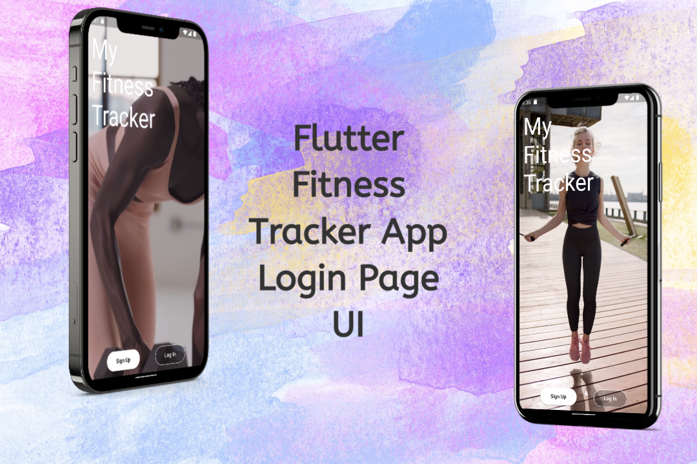

# Fitness App Tracker LogIn UI Design

Using Flutter  
I create a modern and animated log-in screen design 
with simple code, we will create login page for fitness app tracker

----------------------------------------------------------
## View in YouTube

  

## App preview

